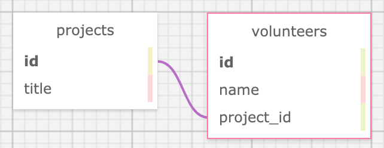

<div align="center">
  
</div>  
  
## _An Application to Track and Assign Volunteers to Projects_
### by: Micah L. Olson
### created: 3/12/2021
* * * 

## Description
*Three Cheers (for Volunteers)* is an application that assists users in tracking projects and the volunteers working on them. Each project can have multiple volunteers, but a volunteer can only be assigned to one project at a time. Users will have the ability to view, add, update and delete projects, view and add volunteers, and add volunteers to a project.  
* * *

## Technologies
* Ruby 2.6.5
* Sinatra 2.1.0
* Embedded Ruby (ERB)
* PostgreSQL (psql) 12.6
* pg 1.2.3
* Bundler 1.17.2
* TDD (Test-driven development)
* RSpec 3.10
* Capybara 3.34.0
* Pry 0.14.0
* HTML
* CSS
* Bootstrap 4.6.0
* git 2.30.1
* * *

## Requirements
* You will need to use your system's **terminal emulator** to setup and locally use this application.
* `PostgreSQL 12.6` is **required** to run the database system that the app uses to store and retrieve data ([how to install PostgreSQL 12.6](https://www.learnhowtoprogram.com/ruby-and-rails/getting-started-with-ruby/installing-postgres)).
* You **must** have `Ruby 2.6.5` installed to be able to launch this application ([how to install Ruby 2.6.5](https://www.learnhowtoprogram.com/ruby-and-rails/getting-started-with-ruby/installing-ruby)).
* `Bundler` is also **required**. *After you install `Ruby`*, it can be installed with the following command.
  ```bash
  $ gem install bundler
  ```
***

## Installation and Setup
* **Clone this repository** to a local directory using the command-line tool `git` ([how to install git](https://www.learnhowtoprogram.com/introduction-to-programming/getting-started-with-intro-to-programming/git-and-github)).  
  ```bash
  $ cd ~/<any>/<local>/<directory>/
  $ git clone https://github.com/MicahOlson/three_cheers.git
  ```

* **Navigate into the project** using `cd` to move to the top level of the project directory.  
  ```bash
  $ cd three_cheers/
  ``` 

* **Install all application dependencies** using `Bundler`. This will install all packages (also known as *Gems*) listed in the project's `Gemfile`.
  ```bash
  $ bundle install
  ```

* Note: Windows users may need to follow different instructions for the next points related to `PostgreSQL` and `psql`. For more details, see "how to install PostgreSQL" in Requirements above.

* **Open TWO new tabs or windows** in your terminal emulator to ensure you maintain access to the command line while you run the database system in the next step (and the local web server in the final steps below).  
  `command-t`, `command-t` on macOS  
  `control-t`, `control-t` on Windows

* **Start the database system** and keep it running while you interact with this application. `PostgreSQL` will run persistently until shut down and you will not have access to the command line in this same window or tab.
  ```bash
  $ postgres
  ```
  * IMPORTANT! Be sure to **shut the database system down** when you are done using the app. In the window where it's running, simultaneously hold down the following two keys on your keyboard.  
    `control-c`

* **Create the databases** the app will use to store data. This app will not run without these.
  ```bash
  $ createdb volunteer_tracker
  $ psql volunteer_tracker < database_backup.sql
  $ createdb -T volunteer_tracker volunteer_tracker_test
  ```

* **Launch the application** in your system's default browser.
  ```bash
  $ ruby app.rb
  ```
    * Similar to the `postgres ` command above, this will run a local server that needs to be **shut down** when you are done using this app. Use this same key combination to do so.  
    `control-c`

* If it didn't open automatically after running the command above, type **localhost:4567** into your browser's address bar and click go.
***

## Testing
* This project was created using **test-driven development** (TDD).

* To **see the *unit* and *integration* test suites**, use `cat` to view the contents of this project's specs files (or open them in a code editor; see below).
  ```bash
  $ cat spec/project_spec.rb
  ```
  ```bash
  $ cat spec/volunteer_spec.rb
  ```
  ```bash
  $ cat spec/volunteer_integration_spec.rb
  ```

* To **run the test suites** yourself and verify program functionality use `RSpec`, one of the *Gems* installed by `Bundler` in the instructions above.
  ```bash
  $ rspec
  ```
***

## Database Schema
  

<div align="center">
  
</div>
  
***

## Code Editors
* If you would like to utilize a GUI for opening or editing this project's files, here are some **recommended code editors**:
  * [Visual Studio Code](https://code.visualstudio.com) - "Code editing. Redefined."
  * [Atom](https://atom.io) - "A hackable text editor for the 21st Century"
  * [SublimeText](https://www.sublimetext.com) - "A sophisticated text editor for code, markup and prose"
***

## Notes, Bugs, Fixes, and Future Improvements
* No known bugs.
* There are no feature enhancements currently scheduled for this application.
* If you find a bug, please report it at the email address below.
***

## License
[GPLv3](https://choosealicense.com/licenses/gpl-3.0/)\
Copyright &copy; 2021 Micah L. Olson
* * *

## Contact Information
Micah L. Olson at <a href="https://www.linkedin.com/in/micah-lewis-olson/" target="_blank">LinkedIn</a> or by <a href="mailto:micah.olson@protonmail.com" target="_blank">email</a>.